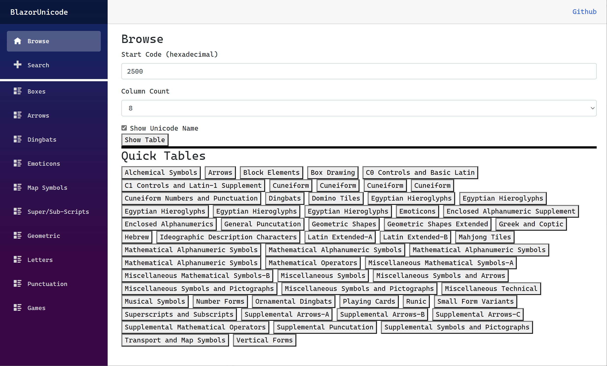
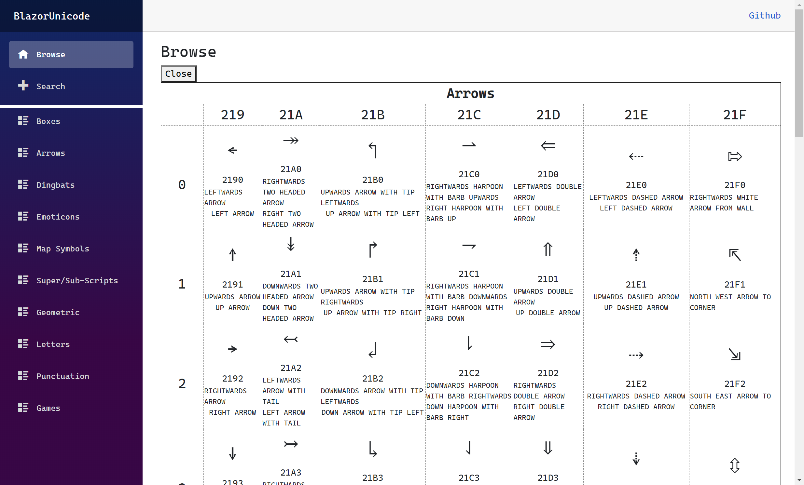
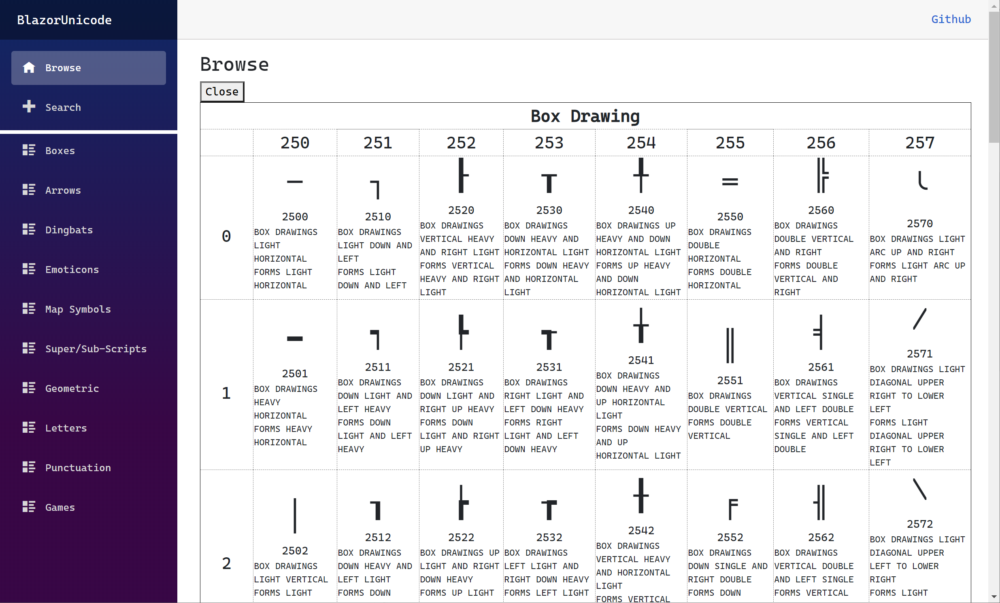
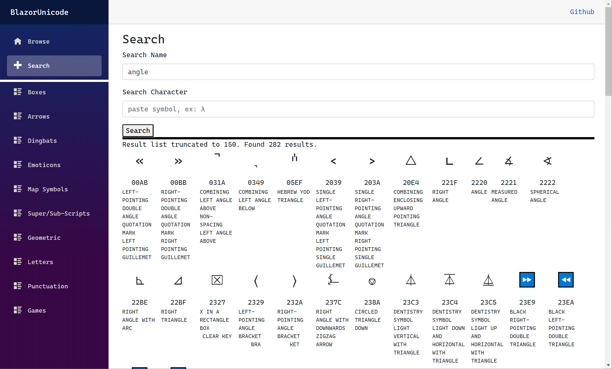
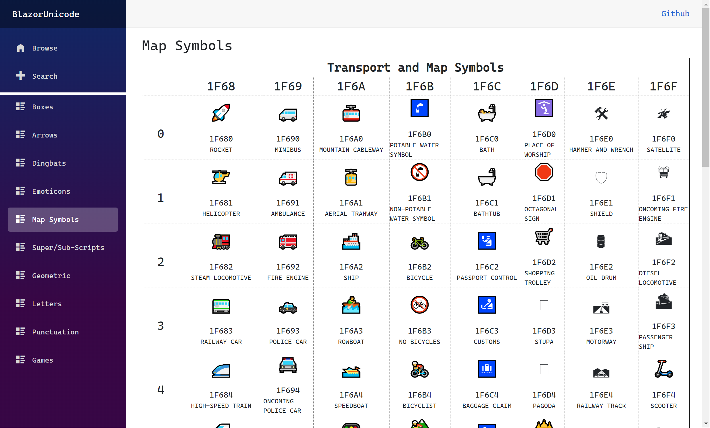
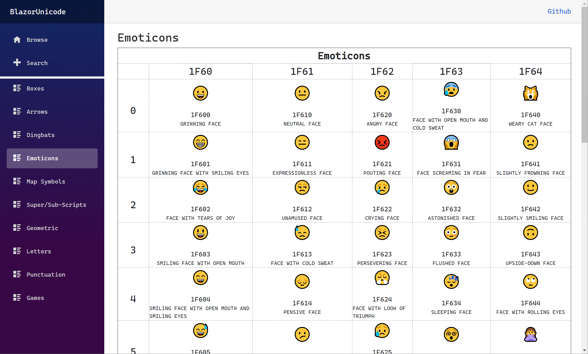

## Blazor Unicode WASM + Progressive Web Application

This is a PWA convergence of my C# code snippets built over the years to work with Unicode and Unicode fonts. The original code is based on several [LINQPad](https://www.linqpad.net/) C# snippets. This application uses [Microsoft's own (excellent) Cascadia Code font](https://github.com/microsoft/cascadia-code); for both the uesr interface and for the rendering of the code points.

You can try this application from here:  [Azure Static Apps](https://green-water-0d096c610.azurestaticapps.net)

Some of the things I find myself doing frequently is:
* Looking for the Unicode values for box elements.
* Looking to see if there is something in the font I can use (name searches).
* Given a page that has a character, just learning more about that (uni)code point.
* Just browsing all the effort put into a font.

### Running locally using docker

1. Build the container using:

```powershell
.\build.ps1
```

2. Run a temporary image using:
 
```powershell
.\run.ps1
```


Here are some useful links and tools:
* [Microsoft Cascadia Code font](https://github.com/microsoft/cascadia-code)
* [LINQPad](https://www.linqpad.net/)
* [High-Logic FontCreator](https://www.high-logic.com/font-editor/fontcreator)
* [High-Logic MainType](https://www.high-logic.com/font-manager/maintype)

## Screenshots
The Main Page


Browsing the Arrows


Browsing from the Code Point 2500


Example Search for 'angle'


Browsing Map Symbols


Browsing Emoticons

